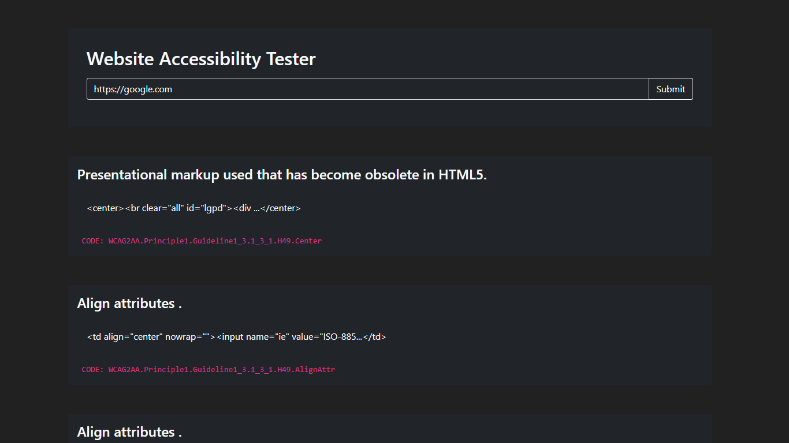

# Accessibility Tester

A web app that finds website accessibility issues using [Pa11y](https://github.com/pa11y/pa11y)

## Demo



## Usage

- Clone the repository

- Install the dependencies

```
$ npm i
```

- Start the server

```
$ npm start
```

- Open `http://localhost:5000` to try the app

_Enjoy 🤗_
